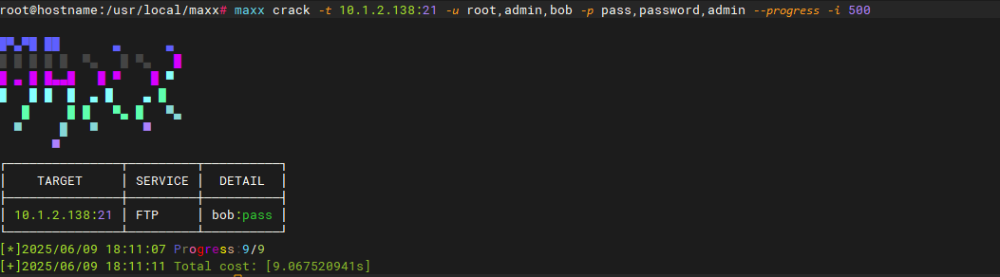

  

> This tool is intended for use by authorized security testers only. Unauthorized testing is prohibited and will be at your own risk.

## MaXx
MaXx is a modular network security scanner combining:
- Port scanning with service fingerprinting  (Coming soon)
- Vulnerability assessment (CVE detection)  (Coming soon)
- Credential auditing (Brute-force & dictionary attacks)  (Implemented in the initial release)
- Automated exploit chaining (Beta:Coming soon)

> If you like this tool, please star it~

### Snapshot

# Reference Projects

https://github.com/chainreactors/zombie

https://github.com/lcvvvv/kscan
