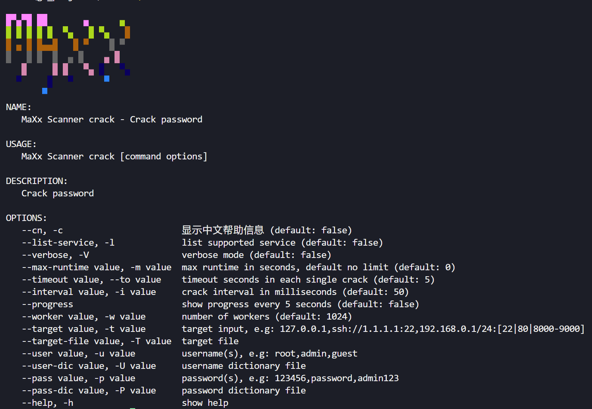

  

> This tool is intended for use by authorized security testers only. Unauthorized testing is prohibited and will be at your own risk.

## MaXx

MaXx is a modular network security scanner combining:

-   Port scanning with service fingerprinting (Coming soon)
-   Vulnerability assessment (CVE detection) (Coming soon)
-   Credential auditing (Brute-force & dictionary attacks) (Implemented in the initial release)
-   Automated exploit chaining (Beta:Coming soon)

> If you like this tool, please star it~

### About Service Cracking

For webshell brute-force details, refer to [docs/webshell](docs/webshell.md)

### About Vulnerability Scanning

**Comming soon**

### Snapshot

### 🚀 Project Roadmap

#### 📅 June: WebShell Detection & Brute-Force Module

-   **Compact Webshell Detection**: Supports fingerprinting and brute-force attacks for common PHP/ASP/JSP one-liner webshells
-   **Advanced Webshell Analysis**: Capable of identifying and testing popular frameworks (Godzilla/Ice Scorpion, Behinder/Chopper)
-   **Intelligent Form Cracking**: Automated login brute-forcing with integrated CAPTCHA bypass (OCR/TensorFlow)

#### 🌞 July-August: OWASP Top 10 Scanner

-   **Comprehensive Vulnerability Assessment**: Full coverage of OWASP Top 10 threats (SQLi, XSS, CSRF, etc.) with CTF/red team optimizations
-   **Adaptive Payload Engine**: Context-aware attack vector generation with false-positive reduction
-   **Risk Prioritization**: Automated CVSS scoring and remediation guidance

#### 🍂 September-October: Asset Discovery Suite

-   **High-Performance Port Scanning**: Async TCP/UDP scanning with service correlation
-   **Precision Fingerprinting**: Version detection for 2000+ web apps/middleware/databases
-   **Integrated PoC Framework**: Native support for nuclei/xray templates with validation checks

#### ❄️ December: Autonomous Security Platform

-   **End-to-End Pentesting**: Unified workflow (Discovery → Credential Testing → Vuln Scanning → Exploitation)
-   **Executive Reporting**: Auto-generated reports with executive summaries and technical details
-   **Exploitation Chaining**: Conditional attack paths based on vulnerability relationships

 

# Reference Projects

https://github.com/chainreactors/zombie

https://github.com/lcvvvv/kscan
