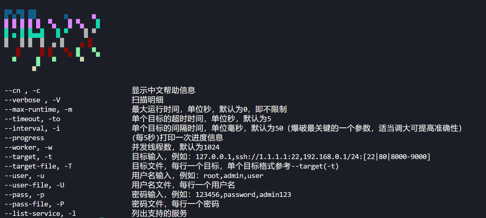

  

> 本工具仅供授权的安全测试人员使用。未经授权的测试是被禁止的，风险自负。

## MaXx
MaXx 是一个模块化的网络安全扫描器，集成了以下功能：
- 端口扫描与服务指纹识别（即将推出）
- 漏洞评估（漏洞挖掘与验证）（即将推出）
- 凭证审计（暴力破解与字典攻击）（已在初始版本实现）
- 自动化漏洞利用链（Beta：即将推出）

> 如果你喜欢这个工具，请为它点个 star~

### 截图

### 🚀 开源计划

#### 📅 6月计划：WebShell爆破模块
- **一句话木马爆破**：支持常见PHP/ASP/APS/JSP/JSPX一句话木马检测与爆破
- **知名webshell爆破**：支持Godzilla（哥斯拉）、Behinder（冰蝎）等流行webshell探活与爆破
- **智能表单爆破**：自动化表单登录爆破，集成验证码OCR识别技术，突破传统爆破限制

#### 🌞 7-8月计划：OWASP Top10漏洞扫描
- **全自动漏洞检测与挖掘**：覆盖SQL注入、XSS、CSRF等OWASP十大Web漏洞，主要服务于漏洞挖掘和CTF自动化
- **智能Payload生成**：动态生成攻击向量，提高漏洞检出率
- **风险等级评估**：自动划分高危/中危/低危漏洞，提供修复建议

#### 🍂 9-10月计划：资产发现与漏洞扫描
- **智能端口扫描**：TCP/UDP全端口扫描
- **指纹识别引擎**：Web应用/中间件/数据库的精准指纹识别
- **PoC漏洞验证**：集成主流漏洞概念验证框架（如nuclei、xray），杜绝误报漏报

#### ❄️ 12月里程碑：全自动化扫描器
- **闭环安全评估**：从资产发现（端口扫描）→ 弱口令爆破 → 漏洞扫描 → 漏洞利用的全流程自动化
- **智能报告系统**：一键生成专业级安全评估报告（含风险统计、漏洞详情、修复方案）

 

# 参考项目

https://github.com/chainreactors/zombie

https://github.com/lcvvvv/kscan
