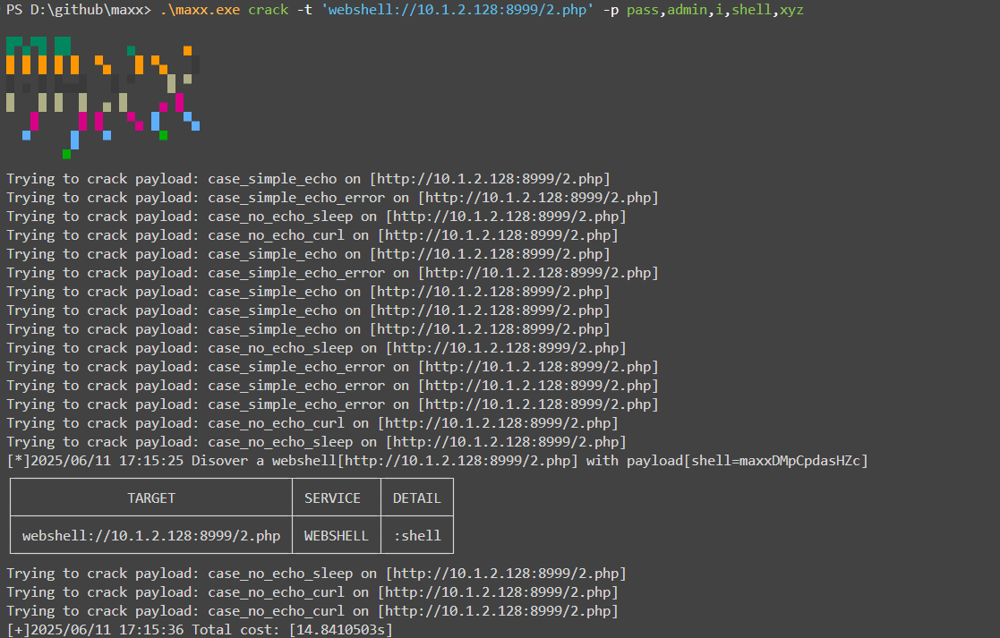

# Supported Webshell Types

In the initial implementation, I collected almost every webshell script I could find online and even created a dedicated webshell cracker to accurately scan for these webshells (about 680 types). However, when integrating into maxx, I found that overly complex parameter configurations and encoding/decoding processes would hinder maxx's development. Therefore, maxx prioritizes "automation" and "lightweight" features. The webshell scanning in maxx focuses on the following types:

-   Common "one-liner" webshells (such as PHP one-liner, JSP one-liner)
-   Godzilla webshells
-   Behinder webshells
-   ...

A more powerful and comprehensive webshell scanner may be released as a separate open-source project in the future.

# Webshell Cracking Commands

Example commands:

```bash
# Crack via command line input
maxx crack -t 'webshell://ip:port,godzilla://ip2:port2,behinder://ip3:port3' -p 'pass1,pass2,pass3'

# Crack via file input
maxx crack -T target.txt -p pass.txt
```

## Example Screenshots


