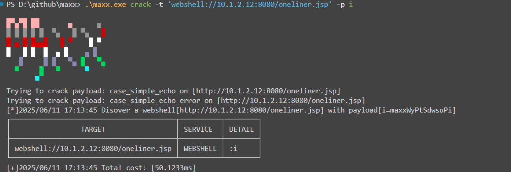
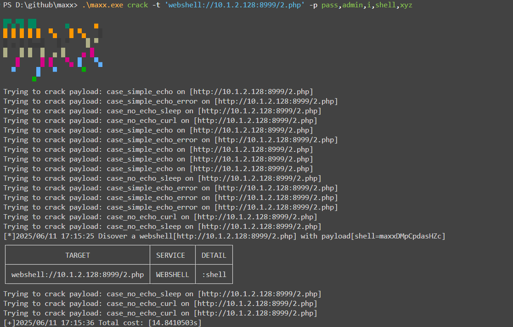
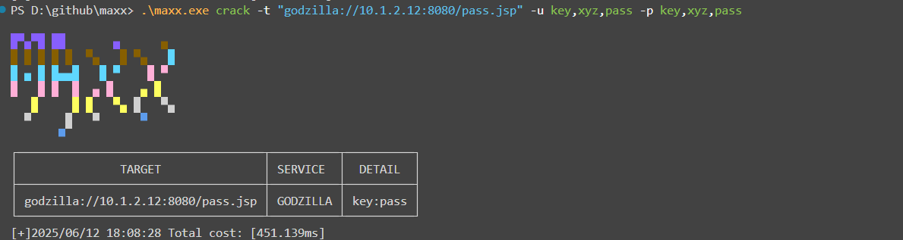

# Webshell 种类支持

在最初实现上，我几乎收集了网上一切能找到的 webshell 脚本，并专门制作了一个 Webshell 爆破器，用于精准地扫描出这些 webshell（大概 680 多种），但实际应用到 maxx 中我发现过于复杂的参数配置和扫描编解码加解密流程会使 maxx 的开发受阻。maxx 会优先以“自动化”和“轻量化”这些特性发布。因此，maxx 对 webshell 的扫描会着眼于以下几类：

-   常用的“一句话”木马（如 php 一句话、jsp 一句话）
-   Godzilla（哥斯拉）木马
-   Behinder（冰蝎）木马
-   。。。

更强大更全面的 webshell 扫描器也许在我下一个开源作品里单独发布

# Webshell 爆破命令

命令形如以下：

```bash
# 命令行输入爆破
maxx crack -t 'webshell://ip:port,godzilla://ip2:port2,behinder://ip3:port3' -p 'pass1,pass2,pass3'

# 基于文件输入爆破
maxx crack -T target.txt -p pass.txt
```

## 运行截图示例






